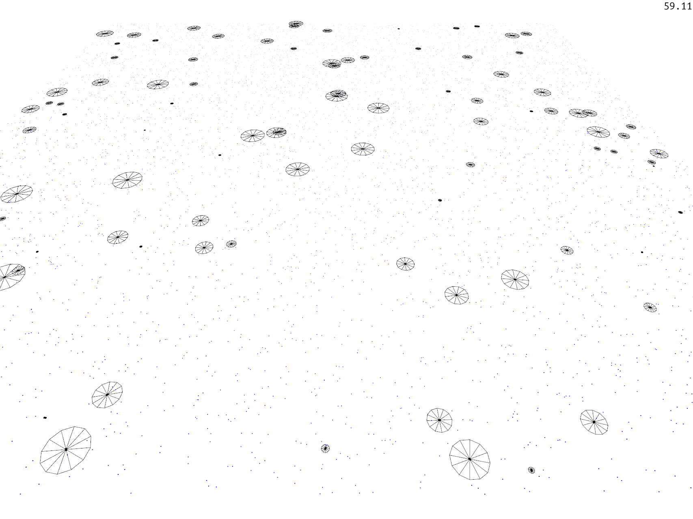
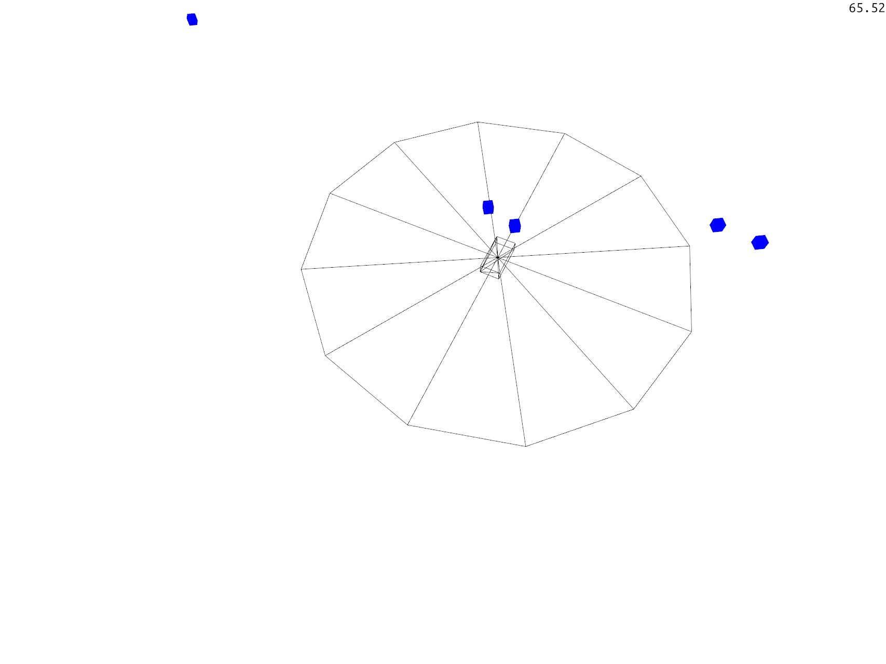
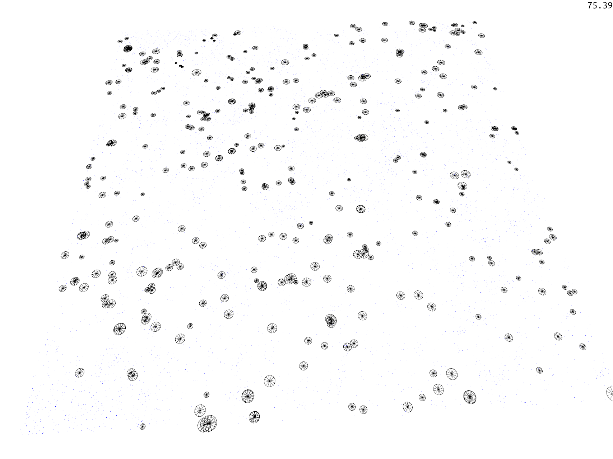

# transit 

Agents possess energy that continually runs down. At zero energy they die.
By eating food quanta, they can restore some amount of energy. Every agent trades
speed against range of detecting food. They move towards the closest food they can
see given their range.
If some threshold of energy is reached, they can create offspring by cloning themselves
with some minor mutation to the speed-range tradeoff.
Over time, a convergence towards a speed-range strategy can be observed in the population.
The strategy depends on the food spawn rate and thus how competitive the area is.





### Running
Execute
```
cargo run --release
```

### Control
Click and drag the mouse to look around, use your mousewheel to zoom in and out.
Click and hold the middle mouse button and drag the mouse to change camera angle.
